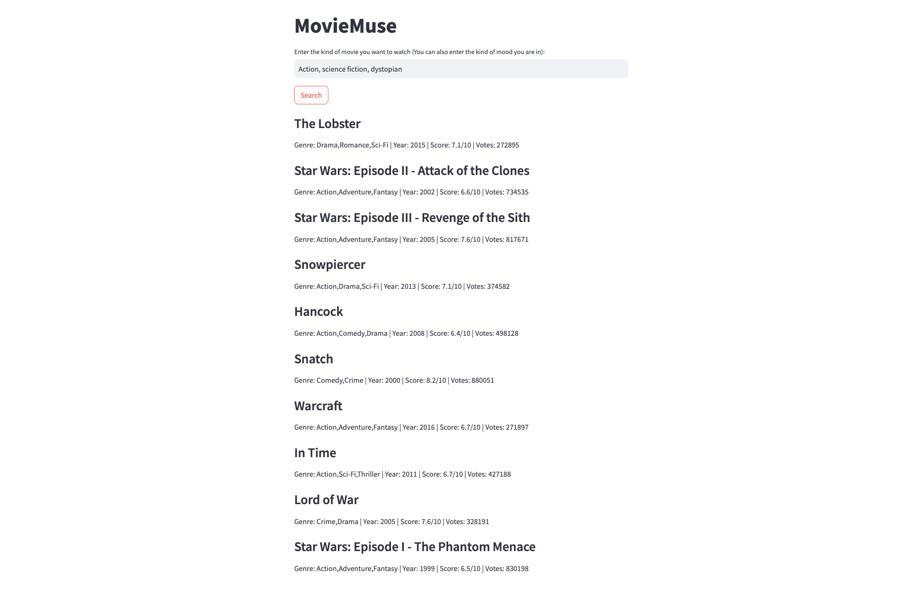

# MovieMuse - Movie Recommendation App

Welcome to MovieMuse, your ultimate movie recommendation app that helps you discover the perfect movie based on your preferences! Whether you're in the mood for a specific genre or looking for a movie to match your current emotions, MovieMuse has got you covered. Powered by DeepLake, Langchain, and Streamlit, our app uses advanced language modeling and a vector database to provide you with personalized movie recommendations from the top 1000 movies on IMDB.




## Behind the Scenes

1. **User Input**: To get started, the application collects input from the user regarding their current emotional state or the type of movie genre they wish to watch. You can express your emotions through a text input or choose a specific movie genre from the provided options.

2. **Emotion Encoding**: The emotions provided by the user are then sent to our Language Model (LLM). The LLM skillfully interprets and encodes these emotions, ensuring an accurate representation.

3. **Similarity Search**: Using the encoded emotions, MovieMuse performs a similarity search within our vector database, known as the "DeepLake Vector Store in LangChain." This vector database contains emotional embeddings of the top 1000 movies on IMDB.

4. **Movie Selection**: From the pool of movies with the highest similarity scores, the app randomly selects a movie to recommend. To make the selection process more intuitive, the algorithm gives preference to movies with higher similarity scores, ensuring that the recommendation closely aligns with your emotional state or preferred genre.

5. **Movie Details**: Once the movie recommendation is generated, MovieMuse displays essential details about the chosen movie, including its title, genre, and IMDb rating. You will also find a brief summary and trailer to help you make an informed decision.

### How to Run It

Follow these steps to run MovieMuse on your local machine:

1. Create a virtual environment to isolate the project dependencies.
   ```
   python -m venv moviemuse-venv
   ```

2. Activate the virtual environment.
   - On Windows:
     ```
     moviemuse-venv\Scripts\activate
     ```
   - On macOS and Linux:
     ```
     source moviemuse-venv/bin/activate
     ```

3. Install the required libraries from the `requirements.txt` file.
   ```
   pip install -r requirements.txt
   ```

4. Create an `.env` file in the root directory of the project with the following format:
   ```
   ACTIVELOOP_TOKEN="YOUR_ACTIVELOOP_TOKEN"
   OPEN_AI_API="YOUR_OPEN_AI_API_KEY"
   ```

   Make sure to replace `YOUR_ACTIVELOOP_TOKEN` and `YOUR_OPEN_AI_API_KEY` with your actual API keys.

5. Run the Streamlit app:
   ```
   streamlit run src/app.py
   ```

   The MovieMuse app will be accessible at `http://localhost:8501` in your web browser.

## Disclaimer

Please note that MovieMuse relies on the quality of the emotional embeddings in the vector database. The accuracy of movie recommendations may vary based on the effectiveness of the language model and the emotional representations. Additionally, the app is designed to provide movie suggestions for entertainment purposes only and does not guarantee a perfect match with your emotions or preferences.

Happy movie exploring with MovieMuse! 🎬🍿